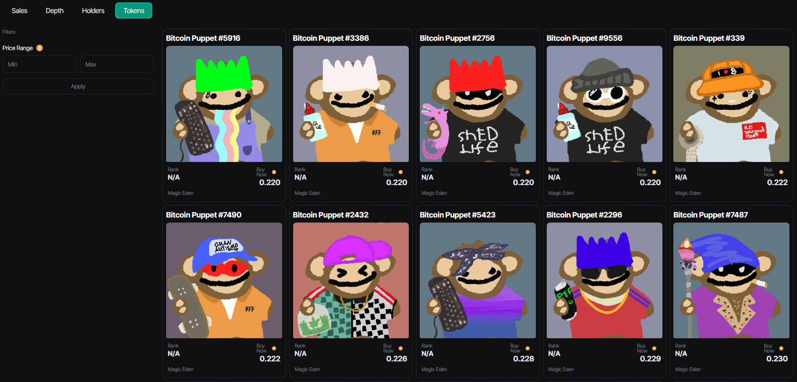

### Bitcoin Puppets: Exclusive NFT Collection Featuring Bitcoin-Themed Digital Puppets

Bitcoin Puppets is a collection of NFTs (Non-Fungible Tokens) consisting of digital puppets themed around Bitcoin. Each NFT in the collection is unique and indivisible, representing an exclusive digital asset that can be bought, sold, or traded on specialized online markets.

:::tip Take a look at our tables
:::

:::info ***Sales***
When we talk about 'Sales with Outliers', this refers to sales transactions within the 'Bitcoin Puppets' collection that stand out due to their unusually high value or volume compared to the rest of the transactions
:::

:::info  ***Depth***
 
_**Depth**_ indicates the quantity of buy and sell orders available, reflecting the market's liquidity and robustness. 
_**Market Depth**_ shows the specific liquidity for the NFTs in the collection. 
_**Total Listings**_ informs the total number of NFTs available for sale, while Total Bid Value presents the total value of buy orders. Users can view the specific marketplace in the _**Marketplace**_ option and the total number of NFTs listed in _**Tokens Listed**_. 
_**Value B**_ represents the total value in a specific currency of all NFTs in the collection. Lastly, _ **% of Total**_ indicates the percentage that the Bitcoin Puppets collection represents of the total NFTs listed on a market or platform.

_**Listings Depth**_ refers to the level of detail or extent of information provided in listings, such as those found on e-commerce websites, real estate search engines, or online catalogs.
:::

:::info ***Holders***
_**Holders**_ are the individuals or entities that hold a particular cryptocurrency in their digital wallets. 

_**Holders Stats**_ provide valuable insights into who these people are, how many coins they hold on average, the distribution of ownership and much more. 
_**Top Wallets**_ are those that hold the largest amounts of a specific cryptocurrency.
:::

:::info ***Tokens***
The Bitcoin Puppets _**Tokens**_ table lists digital tokens linked to Bitcoin, known as puppets because they follow the value or performance of Bitcoin. The table includes information such as the name, symbol, provider, quantity in circulation and market value of each token.
:::

[**Bitcoin Puppets**](/docs/Collection/Bitcoin%20Puppets.md)