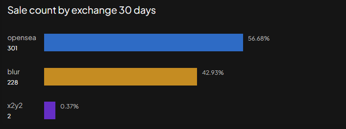

 Our insightful feature  provides a clear window into the world of NFT sales across various exchanges. Here, you can access a comprehensive overview of the sales per exchange, focusing on the past 30 days.

Unveil the power of data as we present you with a detailed breakdown of NFT transactions, highlighting the performance and activity on different platforms. Stay up-to-date with the latest trends, monitor exchange-specific dynamics, and gain valuable insights into the NFT market's pulse.

Whether you're an investor, collector, or enthusiast, this tool empowers you to make well-informed decisions based on real-time sales data. Dive into the world of NFT sales per exchange in the last 30 days and unlock a deeper understanding of this thriving digital ecosystem. Join us now and seize the opportunities that await you.

