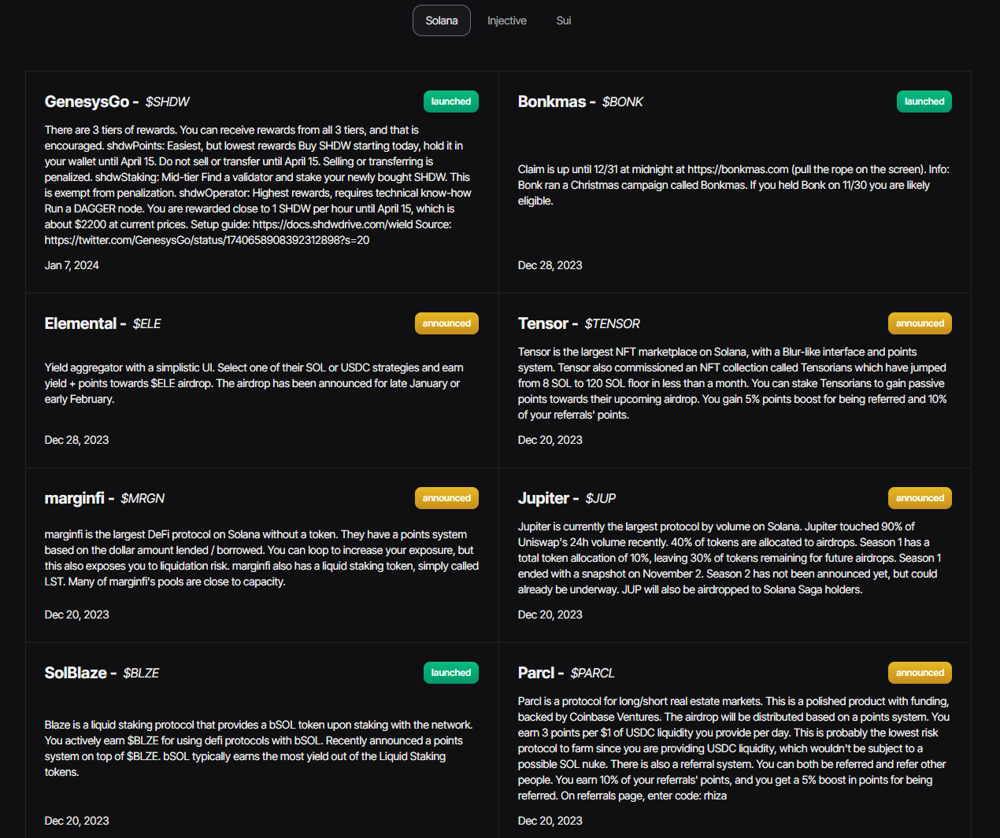
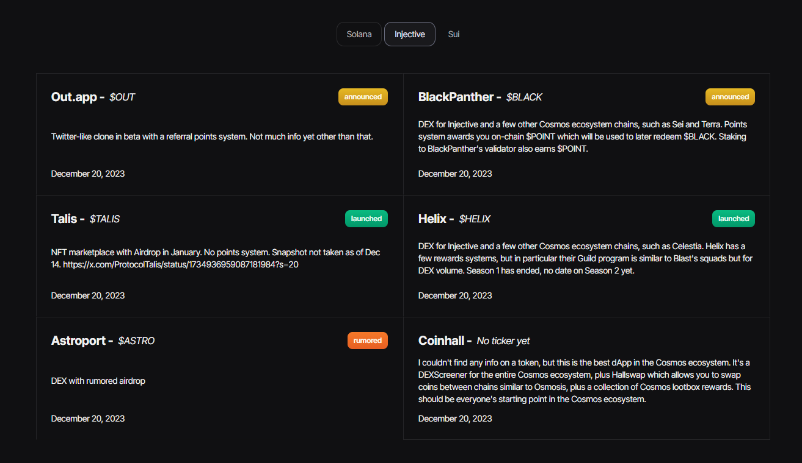
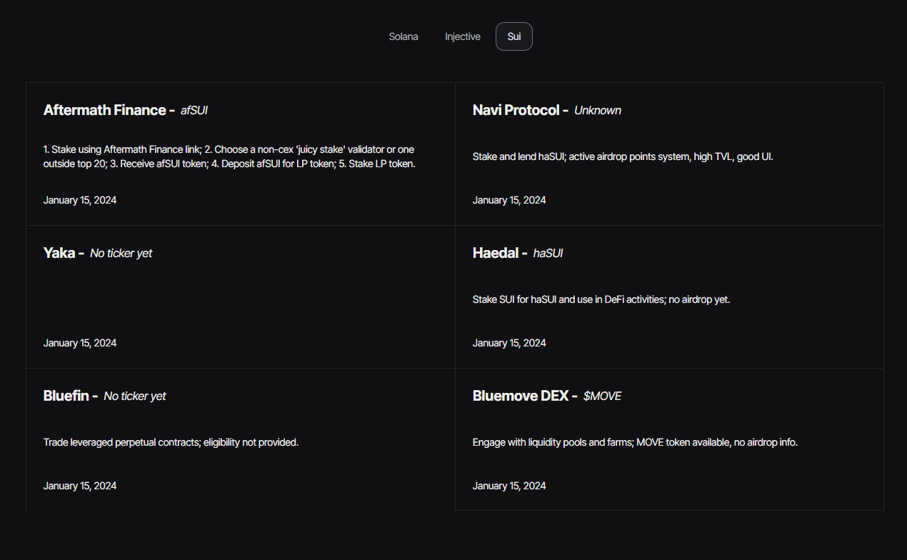

Airdrops are events in which cryptocurrency projects distribute tokens free of charge to existing holders or active members of the community. This practice not only raises the profile of the project, but also rewards enthusiasts in the crypto universe.

Participation can be as simple as owning a specific amount of a cryptocurrency or being active in a community. Some airdrops also involve the exchange of tokens, giving participants the opportunity to explore new digital assets.

Here are some of the benefits of airdrops:

:::tip

- They increase awareness of innovative projects.
- They encourage active participation in the community.
- They distribute tokens in a decentralised way.
- They reward current holders.

:::

On our [Degenz](https://www.degenz.finance/airdrops "Degenz") and together with information provided by [Rhizan](https://twitter.com/rhizanthemum "Rhizan"), you'll find the latest Crypto Airdrops.

In the images, we can see how to learn to grow the instructions.

