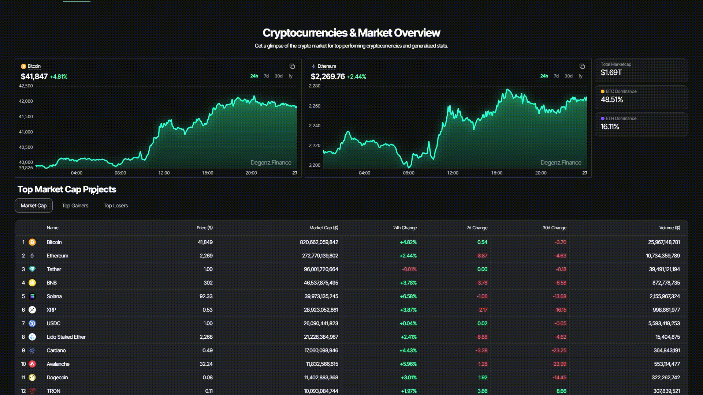
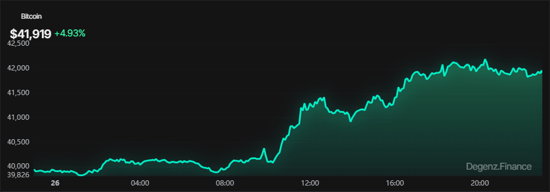
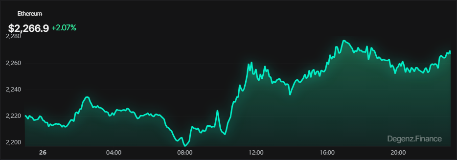
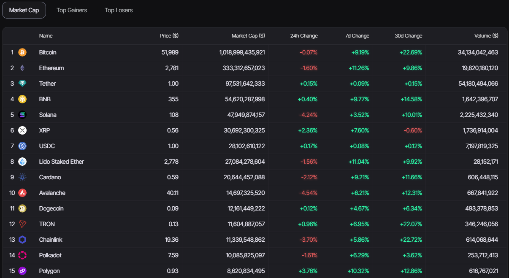
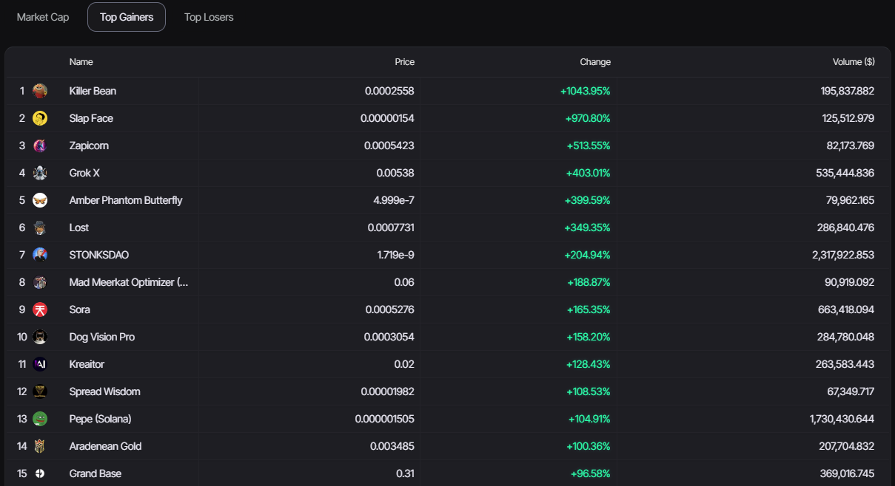
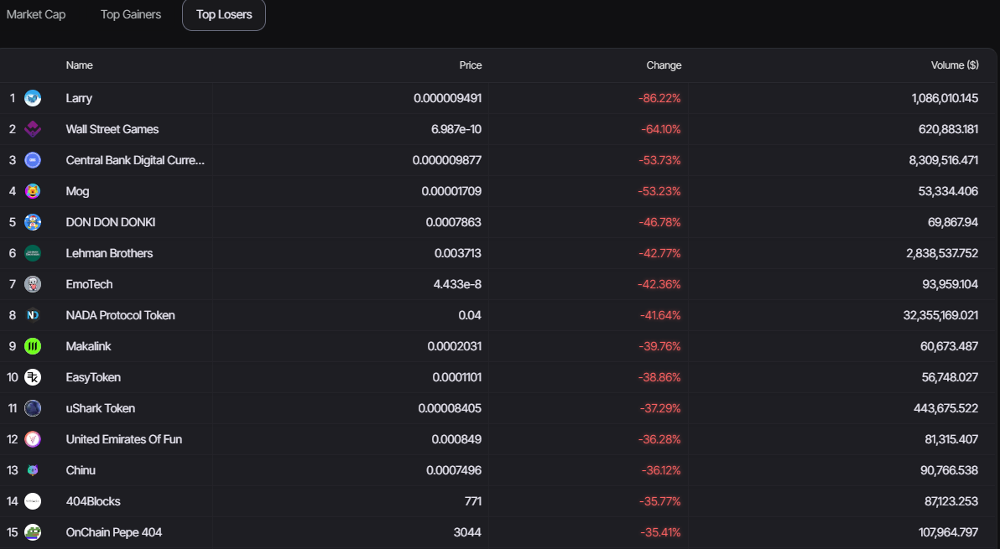

### Streamlined Access to Cryptocurrencies: Explore Updated Tables for Various Periods

We've made it easier to access a variety of cryptocurrencies with simpler options.  We now have the possibility to switch between different cryptocurrencies and view tables updated in 24-hour periods, 7 days, 30 days or even throughout the year.

Find out how you can do it.

:::info Crypto Graphs 
We have an overview of the market values, the main gainers, the main losers and we also have the option to change the cryptocurrency.
:::

:::info Crypto Graphs 
The chart displays Bitcoin values throughout the current day, showing price fluctuations.
:::

:::info Crypto Graphs 
The graph displays the values of Ethereum throughout the current day, showing the price fluctuations.
:::
 

:::info ***Market Cap***
The table below offers a comprehensive understanding of the main cryptocurrencies, presenting crucial information such as current prices, market capitalisation and changes over the last 24 hours, 7 days and 30 days, as well as trading volume. This dataset provides a snapshot of recent trends in the cryptocurrency market, empowering investors and enthusiasts to analyse price movements and make informed decisions based on up-to-date and relevant information.
:::

:::info ***Top Gainers***
This table highlights the Top Gainers, which are the cryptocurrencies that have experienced the biggest gains in value recently. It provides essential information, including the current price of each cryptocurrency, the percentage change in price from the previous period and the trading volume associated with each one.
:::

:::info ***Top Losers***
The table below presents the 'Top Losers', which are the cryptocurrencies that have experienced the largest percentage drops in their value recently. Each entry in the table includes the cryptocurrency's name, its current price, the negative percentage change compared to the previous period, and the associated trading volume
:::

### Source:
- Remembering that some of our updates are based on **[Yahoo Finance](https://finance.yahoo.com/crypto)** in addition to contributions from **[Degenze](https://www.degenz.finance/)** and data from 
**[CoinGecko]( https://twitter.com/coingecko)**.

[**Cryptocurrencies & market Overview**](/docs/Crypto/Digital%20Assets/Cryptocurrencies%20&%20market%20Overview.md)