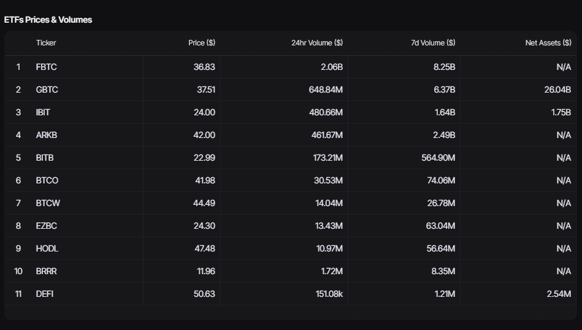
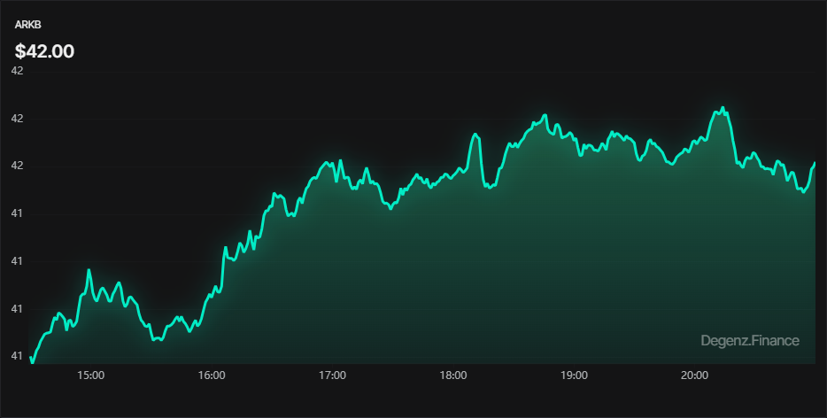
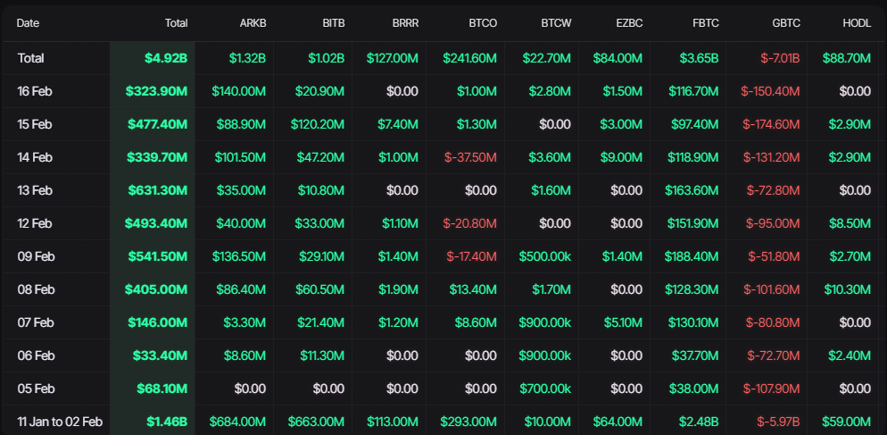

Bitcoin ETFs are investment funds that replicate the price of Bitcoin and are traded on stock exchanges. They provide investors with the opportunity to gain exposure to Bitcoin's performance without the need to own the cryptocurrency directly. ETFs follow the price of Bitcoin, are listed on exchanges, offer ease of trading similar to shares and are custodied to ensure asset protection.

On this page, you can view the volume of ETFs over 24 hours or 7 days, along with the Ticker, price, volume over the 24 or 7 day period, and net assets. This is a useful tool for monitoring the market activity and liquidity of Bitcoin ETFs. The introduction of Bitcoin ETFs aims to provide a more regulated and accessible option for institutional and retail investors.

:::tip
For the most up-to-date information on Bitcoin ETFs, we suggest consulting reliable sources such as Yahoo Finance **[Yahoo Finance](https://finance.yahoo.com/crypto)**.
:::

:::info
 In this table, we find the ticker, the current price and the trading volume over different periods (such as 24 hours and 7 days), as well as the net assets. These metrics provide insights into the fund's trading activity, liquidity and size.
 
:::

:::info
 In this chart, which shows the value of the ETF over time, the updates are in real time. It provides a dynamic visual representation of the ETF's performance throughout the day

:::

## **ETFs Flows**

ETFs Flows represent the inflows and outflows of money from an ETF (Exchange-Traded Fund) over a specific period. They offer insight into investment activity in the ETF, reflecting investor interest and market sentiment.

We have a presentation of data on cryptocurrency transactions over time, sorted chronologically by date.

:::info
 The table provides detailed information on the total number of transactions carried out on each date, as well as specific data on various cryptocurrencies. These details can include transaction volume, average prices and other relevant metrics for each cryptocurrency listed.
:::

