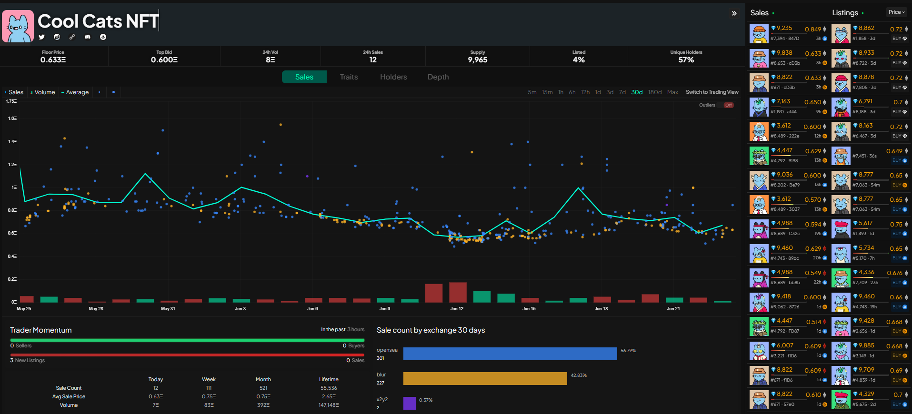

On the Collection page you have an overview that covers the NFT charges, where we can see the main sales of the project through graphs, see the date of the sale, the value, the variations, the volume and we can also select the period that you want to see the updates, 5m, 15m, 1h, 6h, 12h, 1d, 3d, 7d, 30d, 180d and Max where you can see previous years.

