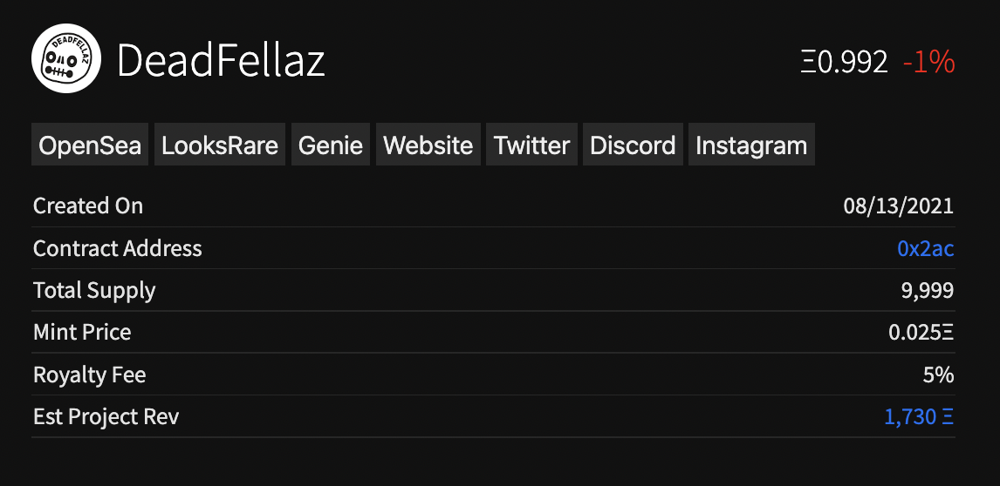
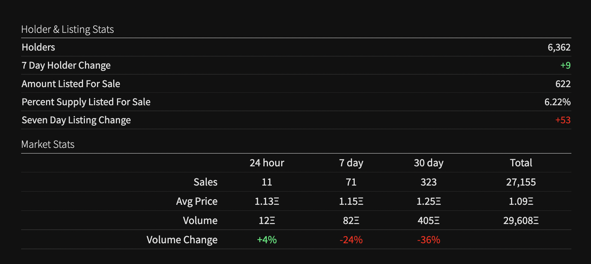
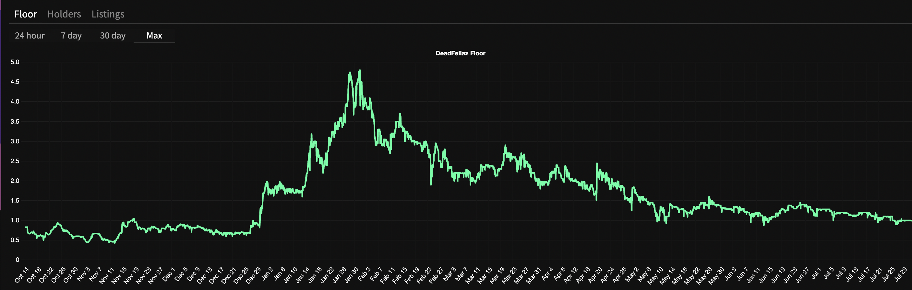
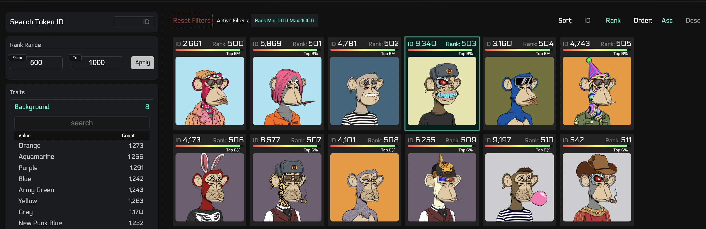
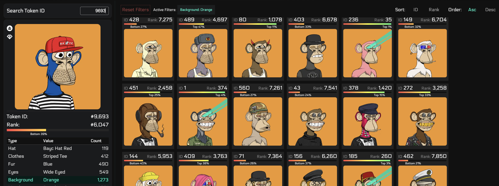
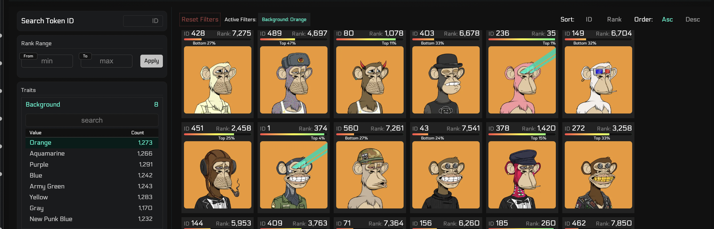

# Collection Page

## Description

This page gives you a comprehensive overview of a NFT collection. 
This includes a summary of market statistics including listings, floor, volume, and holders.
It also allows you to pull up the charts for floor, listings, and holders, and search the collection for any NFTs.

## Page Breakdown

### Project Info
This section provides important information a project. This includes:
- Mint info
- Tokenomics
- Relevant links
- Revenue info

### Market Overview

The Market Overview gives you a glimpse of holders, listings, market stats, and
volume over various timespans from 24 hrs to 30 days.

### Charts

You're able to pull up the charts for the floor, holdings, and listings for various
collections separately. The included timespans are 24 hrs, 7 days, 30 days, and Max.

### NFT Search

One of the most powerful tools on the collection page allows you to search for any
NFT in the collection. You're able to filter by ranks, traits, and token ID. You're
able to also sort as well. 

#### This displays how you can filter by rank 

#### Click on an NFT to get a closer look or by searching for the token ID

#### Filter by traits

