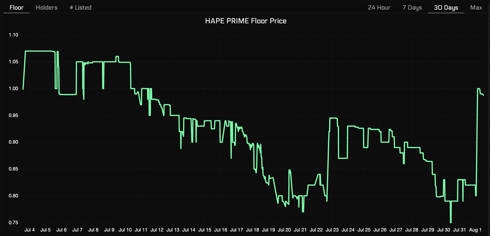
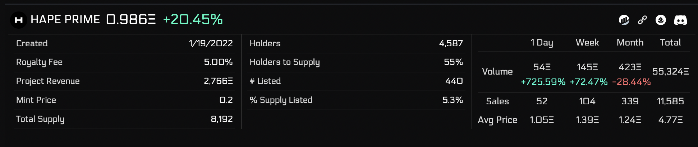
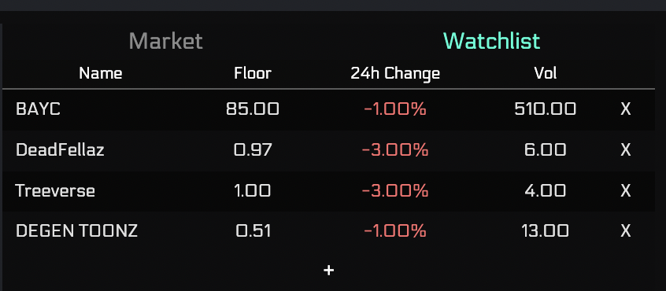
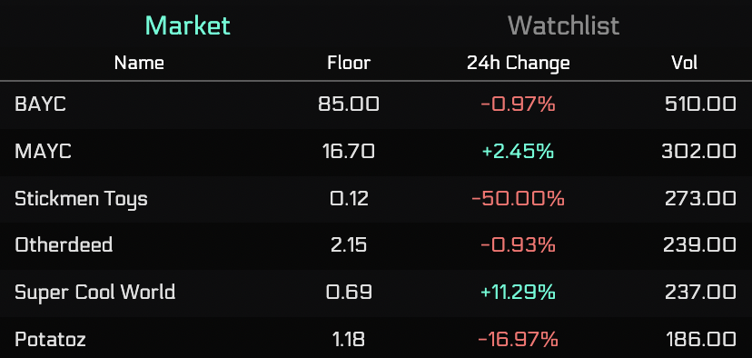

# Dashboard

## Description

Dashboard allows users to pull up any collection to get a glimpse of a specific project
market details and the overall market. 

## Page Breakdown

### Dashboard Charts

Pull up the floor, holders, or listings charts for any collection 
over the 24 hr, 7 day, 30 day, or Max timespans.

### Dashboard Collection Summary

Right below your charts, the collection summary provides important market stats,
relevant links, and collection information.

### Dashboard Watchlists

Select your favorite projects so that you can get a quick summary of their
performance during the day, and easy access to pull up their overview.

### Dashboard Market Summary

Alongside your watchlists, the market summary of the top collections in respective
market stats are displayed to compliment the selected collection summary.

