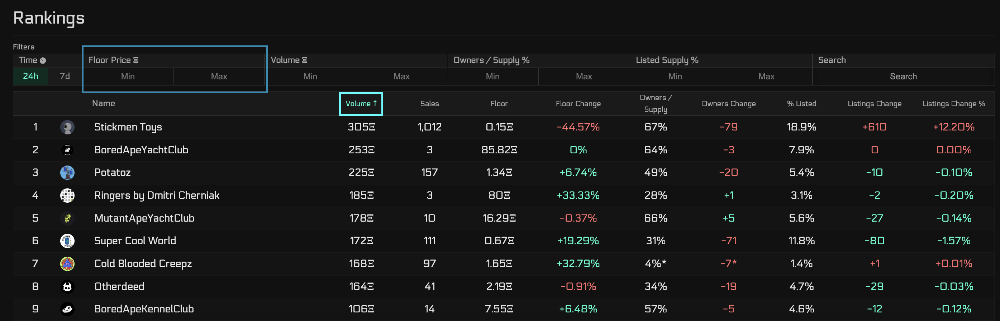
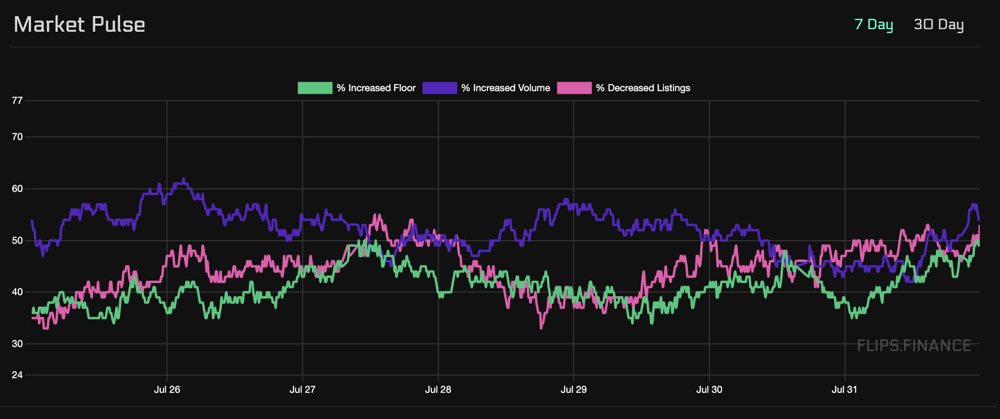
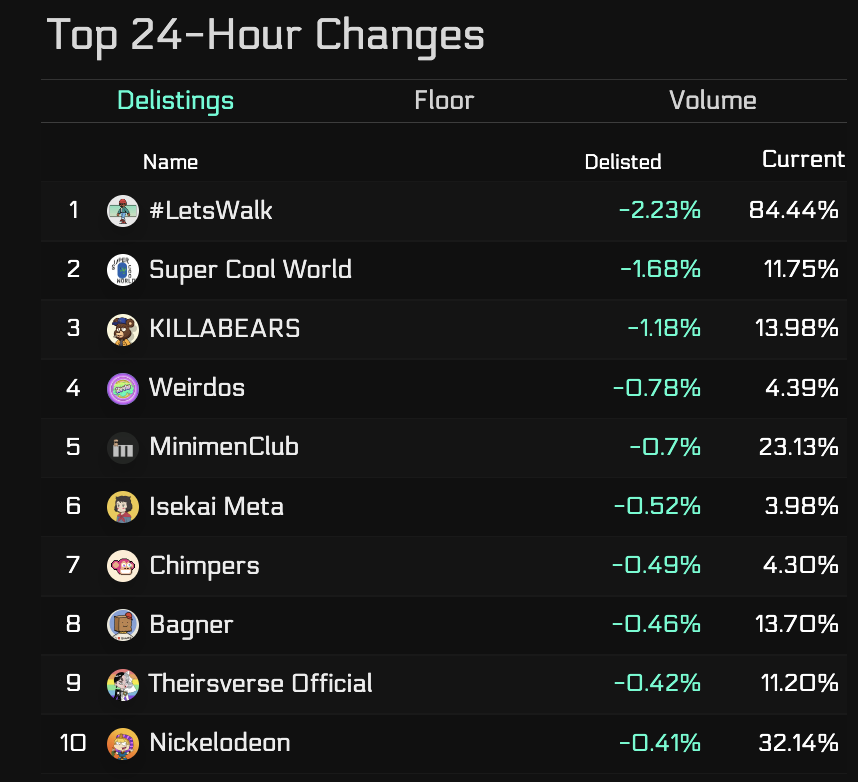

# Home Page

## Description

This page gives displays the famous Rankings and Market pulse. This allows you to 
get a glimpse of the top collections and a general feel of the market.

## Page Breakdown

### Rankings

This shows the top collections that can be sorted by various filters [green box].
This can be filtered by 24hrs or by 7days.

- Volume - The amount of ETH traded over a period of time
- Sales - The number of collection sales
- Floor and change - The price of lowest item and change over a timespan
- Owners/Supply - The number of holders over the supply
- Owners Change - The percent change of owners over a timespan
- % listed - The percent of NFTs listed over the total supply of NFTs
- Listings Change - The magnitude change of listings over a timespan
- Listings Change % - The percent change of listings/supply over a timespan

You can also filter collections that fit within specific criteria [blue box].

- Floor Price
- Volume
- Owners/supply % 
- Listed Supply %
- Collection Name Search

### Market Pulse

#### Market Pulse Chart

The displays the percent of all collections that have positive
or negative changes in floor, holders, and listings in the past 24 hrs from that timestamp. 
It provides you an overview of the health of the market for both 7 day and 30 day timespans.

#### Market Pulse Changes

This summarizes the top 24-hour changes in listings, floors, and volume to paint 
a picture of the top movers in the market.

