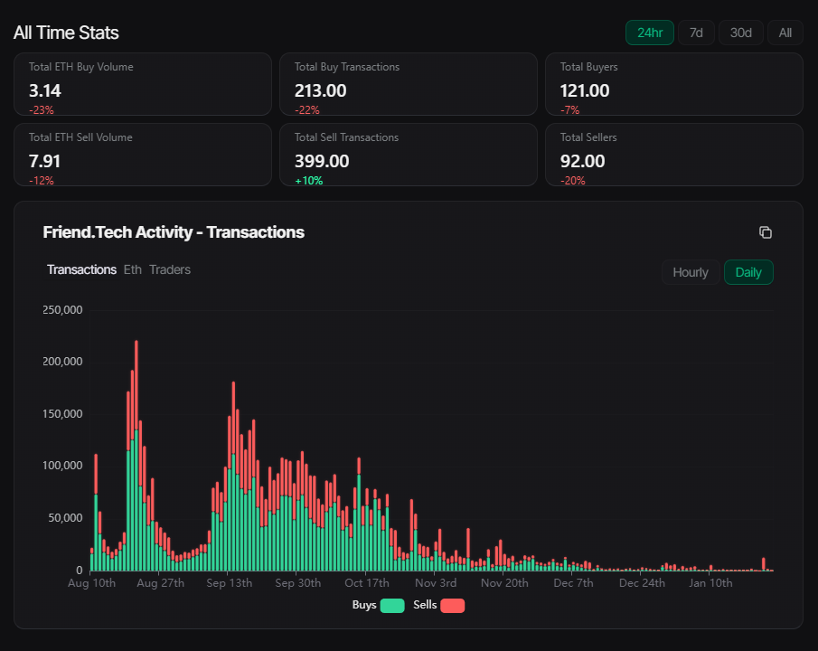
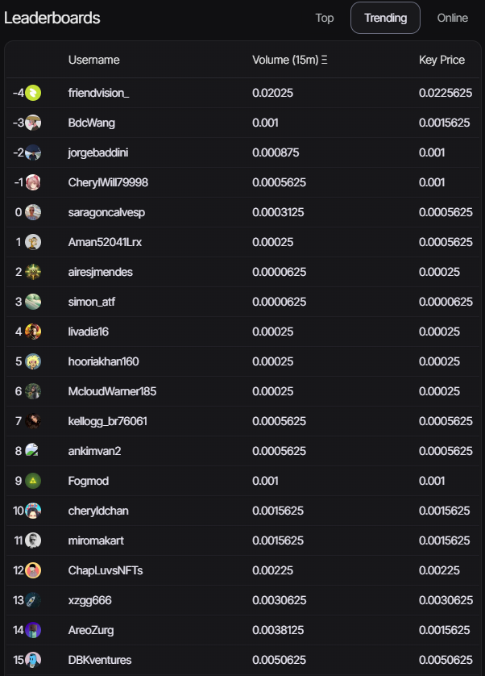

This chart provides a comprehensive view of market statistics, offering a detailed analysis of buying and selling transactions, trading volumes and prevailing trends. 
By looking at the big picture, it is possible to clearly discern market dynamics, understanding not only trading activities but also the patterns that shape market behaviour. This visual representation offers a valuable perspective for those seeking to understand and interpret the nuances of the scenario, allowing for a more in-depth analysis of the interactions between buyers and sellers, as well as the identification of emerging trends.

Below, you can see the leader profiles;

