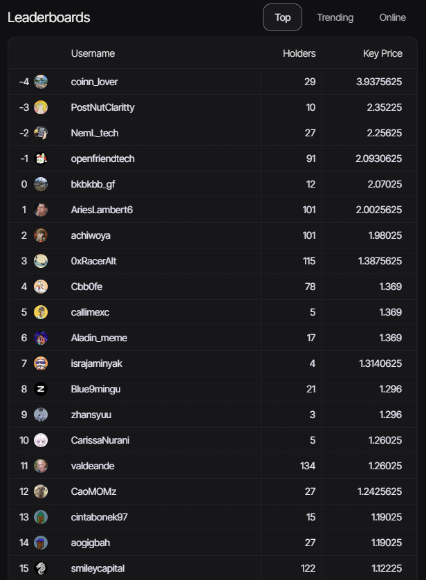
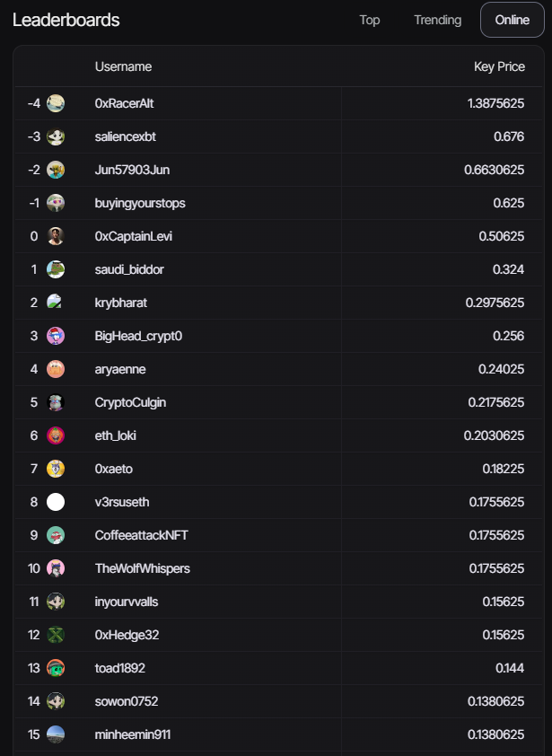

This chart provides a comprehensive view of market statistics, offering a detailed analysis of buying and selling transactions, trading volumes and prevailing trends.  
By looking at the big picture, it is possible to clearly discern market dynamics, understanding not only trading activities but also the patterns that shape market behaviour. This visual representation offers a valuable perspective for those seeking to understand and interpret the nuances of the scenario, allowing for a more in-depth analysis of the interactions between buyers and sellers, as well as the identification of emerging trends.

:::info ***All Times Stats***
The All Times Stats table provides a snapshot of key metrics for the NFT market. It includes essential data such as the total Ethereum (ETH) used in purchases and sales, the number of buy and sell transactions and the count of unique buyers and sellers. It also provides information on activity trends in different time periods: the last 24 hours, the last 7 days, the last 30 days and the entire market history. 
:::

import Tabs from '@theme/Tabs';
import TabItem from '@theme/TabItem';

<Tabs>
  <TabItem value="Total ETH Buy Volume" label="Total ETH Buy Volume" default>
    Total Ethereum (ETH) used in all purchases since the beginning.
    </TabItem>

 <TabItem value="Total Buy Transactions" label="Total Buy Transactions" default>
    Total number of purchase transactions made since the beginning.
    </TabItem>

  <TabItem value="Total Buyers" label="Total Buyers" default>
    Total number of individuals or entities that have made at least one purchase.
    </TabItem>

  <TabItem value="Total ETH Sell Volume" label="Total ETH Sell Volume" default>
    Total Ethereum (ETH) involved in all sales since the beginning.
    </TabItem>

   <TabItem value="Total Sell Transactions" label="Total Sell Transactions" default>
    Total number of sales transactions made since the beginning.
    </TabItem>

   <TabItem value="Total Sellers" label="Total Sellers" default> 
    Total number of individuals or entities that have made at least one sale.
    </TabItem>

</Tabs>

:::tip
See the profiles of the leaders.
:::

:::info ***Top***
In the Top leaderboard, the main highlights are the users who stand out on the basis of essential criteria for the market. Here, we present the usernames of the most prominent participants, along with the number of holders of their unique creations. 
In addition, we display the key price, which represents the fundamental value associated with their works of art or digital assets.
:::

:::info ***Trending***
In Trending leaderboar, we present the usernames of the participants who are generating a high volume of activity, which indicates a recent and significant interest in their creations, and alongside this, we display the key price associated with these trending assets.
:::

:::info ***Online***
In the Online leaderboard, we highlight the users who are active and available at the moment, where you'll find the usernames of the participants who are online and ready to trade, along with the key price of their works or assets available for purchase.
:::
