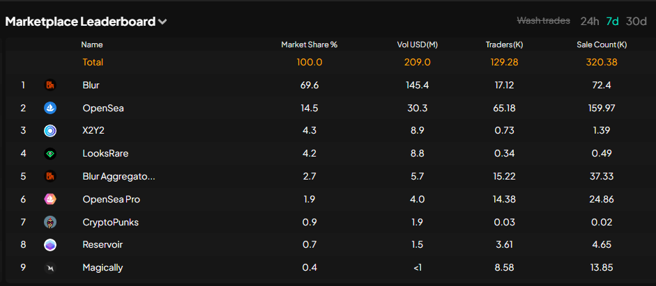

Our informative feature that displays key statistics about the top NFT marketplaces over the past 24 hours, 7 days, or 30 days.

Here, you can explore the performance of the most prominent NFT marketplaces, gaining valuable insights into their activities, trends, and overall market dominance.

With our  interface, you can easily toggle between different timeframes to assess short-term and long-term trends in the NFT market.

Stay informed about the trading volumes, transaction counts, and other crucial metrics that shape the landscape of NFT trading.

