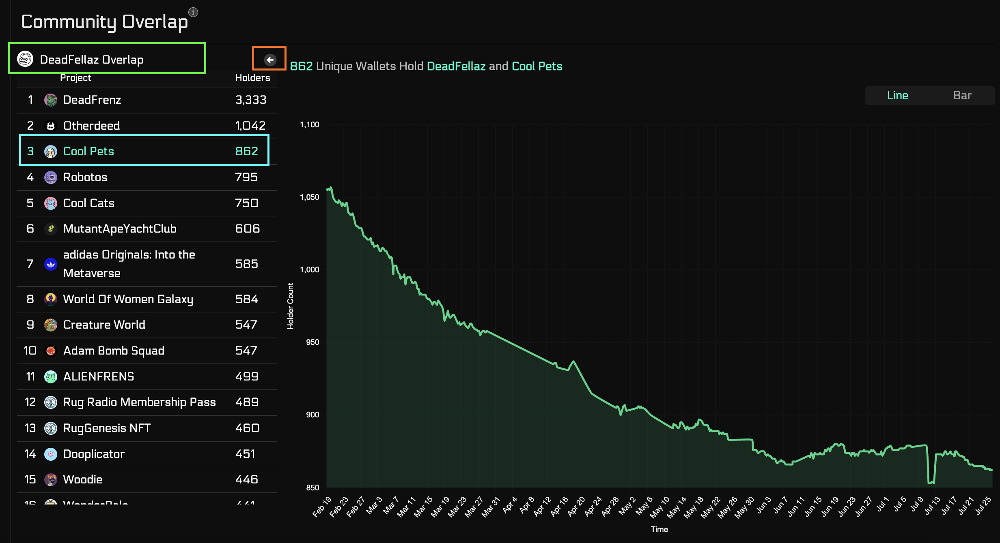
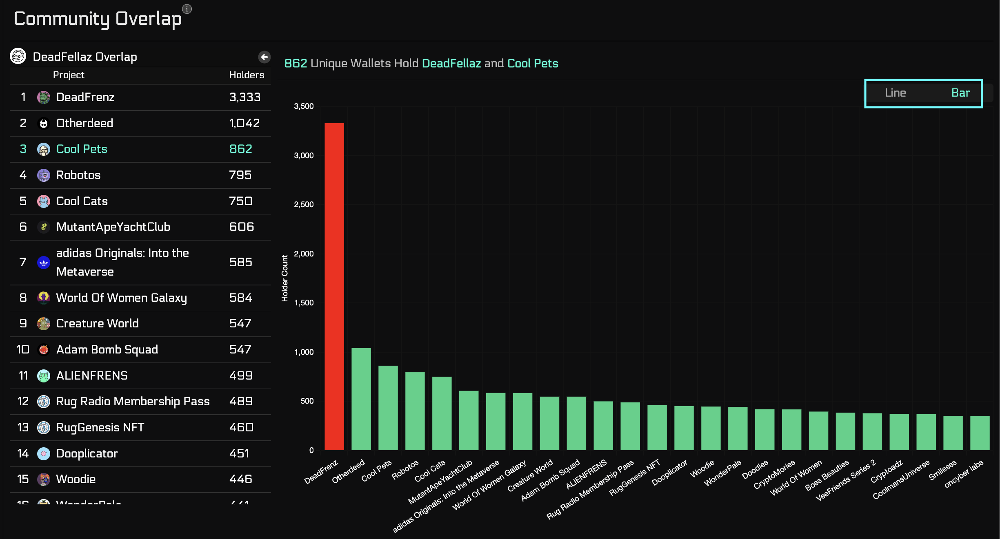
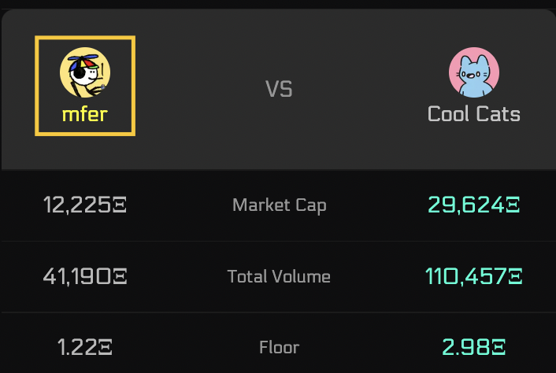
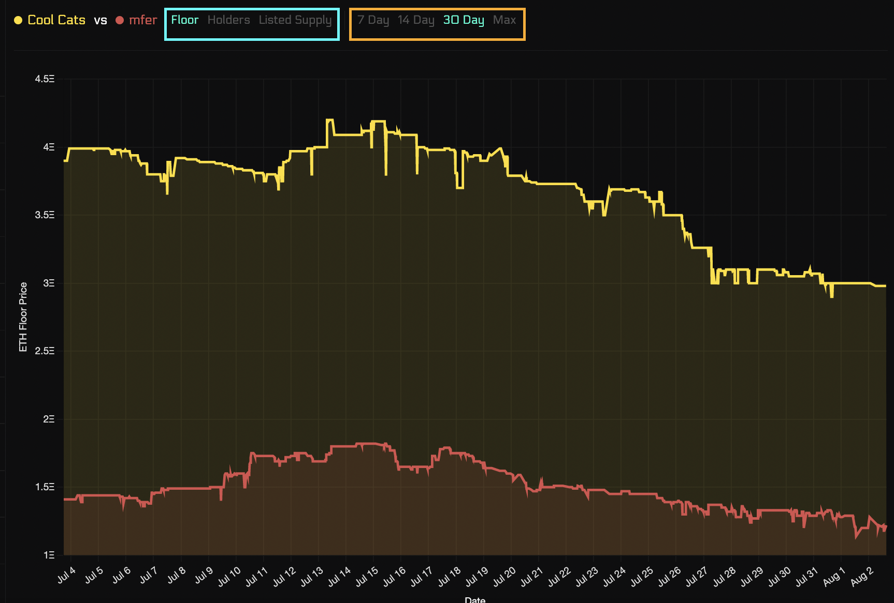
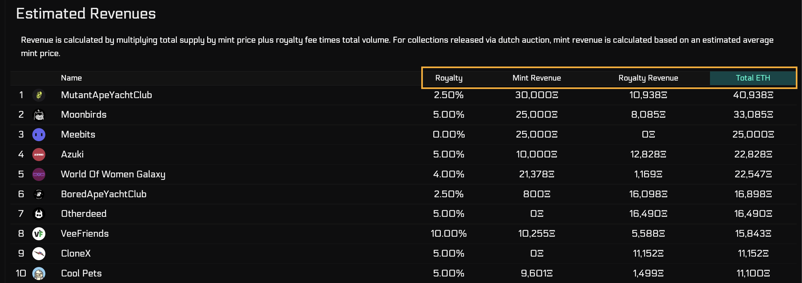

# Rankings

## Overview

The Rankings page is dedicated to revealing deeper on-chain insights about projects
that isn't intuitvely understood from marketplaces. The goal here is to uncover deeper analytics
about projects.

Currently, the page has three main tabs: Overlap, Project Comparison, and Project Revenue.

:::tip Updates!

Pay attention to Research updates. We are continously working on 
Research to add more important pages (such as Distribution *Coming Soon*).
:::

## Page Breakdown

### Overlap

#### Overview
Overlap refers to the overlap of holders between two communities. This gives users
essential information on the momentum between communities, and their digital borders.
For instance, if overlap of Deadfellaz and Degenz is 500, that means there are 500 Deadfellaz holders
that also hold at least one Degenz NFT. 

:::info Definitions

**Primary Collection** - refers to the first collection you choose.  
**Secondary Collection** - refers to any other collection you choose to compare against the primary.
:::

#### Line Charts

The line charts allow you to select a primary collection [green box] and then scroll through to choose
a secondary collection [blue box] to compare. Once you select a secondary collection
you will be able to see a historical line chart of the number of overlaps between the two 
collections, and the title will show you the most recent overlap count.
You can click the back button [orange box] to choose a different primary collection.

#### Bar Charts

The Bar charts show you the overlaps between the primary collection and the top 25 highest 
overlaps with secondary collections. Toggle to the bar chart using the blue box.

### Project Comparison

#### Overview
Project Comparison allows you to compare two collections side by side. Comparing 
various market stats, changes, and general project information while showcasing both 
of their graphs for a specific metric. 

#### Comparison Table
The Project Comparison table illustrates the differences between two projects regarding
market cap, total volume, floor, holders, listings, etc... The picture below displays
a few of these metrics. The green text in the tables illustrate the "better" metric 
in respect to that metric. To change a project, click on the name of the project [yellow box]. 

#### Comparison Graphs
The Project Comparison graph displays the two graphs for the respective metric which could be 
toggled between floor, holders, or listings [blue box]. The timespan can also be changed between
7d, 14d, 30d, and Max [orange box].

### Estimated Revenues

The Estimated Revenues page digs deeper into the finances for all projects. It provides 
mint price and royalty fees and the financial profit from them. 

This is how total revenue is calculated:  

:::info Total Revenue
$Revenue=(TotalSupply*MintPrice)+(TotalVolume * Royalty)$
:::

Revenue is calculated by multiplying total supply by mint price plus royalty 
fee times total volume. For collections released via dutch auction, mint revenue is 
calculated based on an estimated average mint price.

:::info Royalty Fee
The 2.5% represents the Opensea royalty fee. We will include other marketplaces soon.
:::

The screenshot shows a portion of the projects. You can sort by any of those columns: Royalty,
Mint Revenue, Royalty Revenue, Total ETH (Royalty Revenue + Mint Revenue) [orange box]

