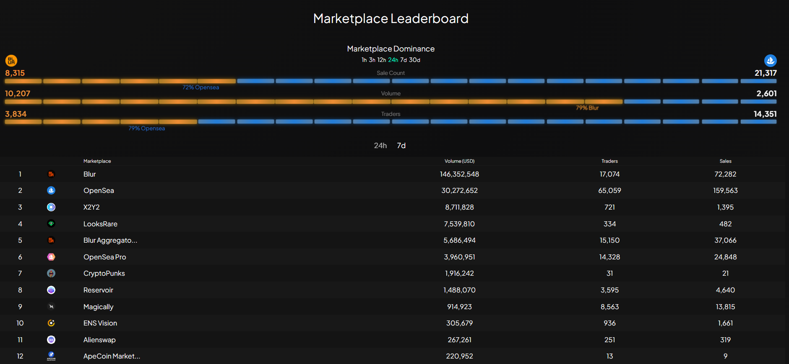

Marketplace Leaderboard page, a powerful tool that allows you to compare and analyze activities across different NFT markets and market domains. Here, you'll find valuable insights such as sales count, trading volume, and the number of traders involved in each marketplace.

Our dynamic leaderboard provides real-time updates, giving you a comprehensive view of the market's performance over various timeframes. Whether you're interested in short-term trends or longer-term patterns, you can easily toggle between 1 hour, 3 hours, 12 hours, 24 hours, 7 days, and 20 days to suit your analysis preferences.

