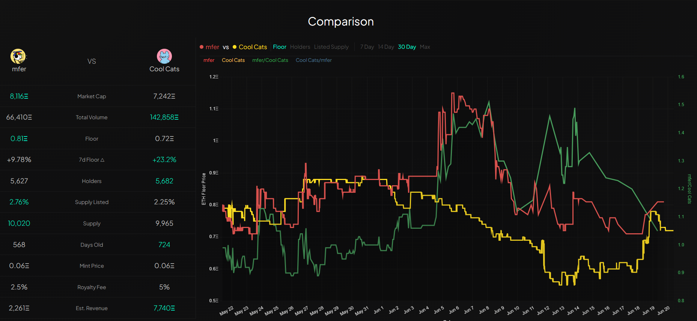

Comparison feature, where you can explore and analyze two projects side by side. Here, you have the power to compare crucial details such as floor prices, number of holders, and the listed supply of the selected projects.

With our interface, you can easily toggle between different time frames, including 7 days, 14 days, 30 days, and even view data for the entire available history.

Discover how the projects stack up against each other, assess their performance over time, and gain valuable insights to inform your decision-making process.

