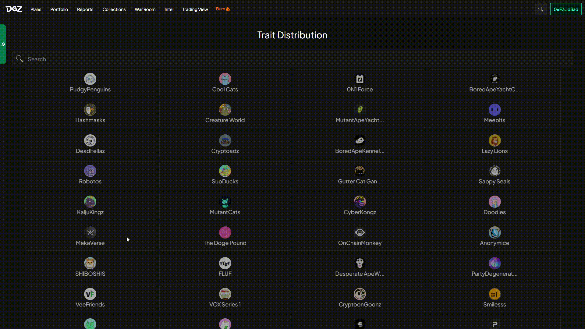

 Trait Distribution feature, where you can explore the fascinating distribution of different characteristics within a collection of NFTs. Our  graph provides a visual representation of essential traits, offering valuable data such as price per floor, recent sales, price differences, count listings, and tokens with unique traits.

Explore the price per floor, giving you an overview of the lowest price at which NFTs with specific traits are listed for sale. Witness the recent sales, providing real-time updates on the latest transactions within the collection.

Discover the count listings, indicating the number of NFTs available for sale with each specific trait, and witness the tokens with unique traits, highlighting the exceptional and rare features that make certain NFTs stand out.

