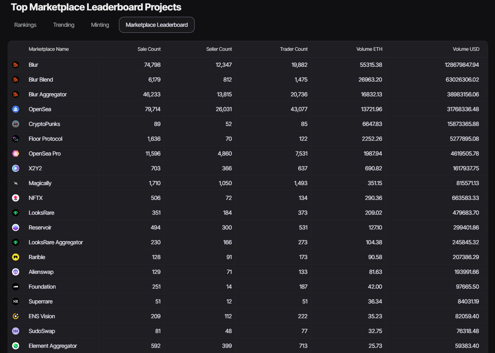

This tool provides a dynamic, real-time overview of the main players in a specific marketplace, highlighting their performance and influence. The ranked list is compiled based on key criteria, offering a comprehensive analysis of the market landscape.

Sales count reveals the prominence of users in terms of successful transactions, showcasing not just frequency but also the consistency and impact of their commercial activities.

Meanwhile, the count of sellers and merchants offers insight into the diversity and breadth of active participation in the marketplace, reflecting the ecosystem's vitality.

Additionally, ETH and USD volume represent the financial scale of transactions, demonstrating the liquidity of the environment and the value added by participants.

Thus, the "Marketplace Leaderboard" not only ranks users based on their activities but also provides an in-depth understanding of the marketplace dynamics, highlighting its vitality, diversity, and financial influence.

