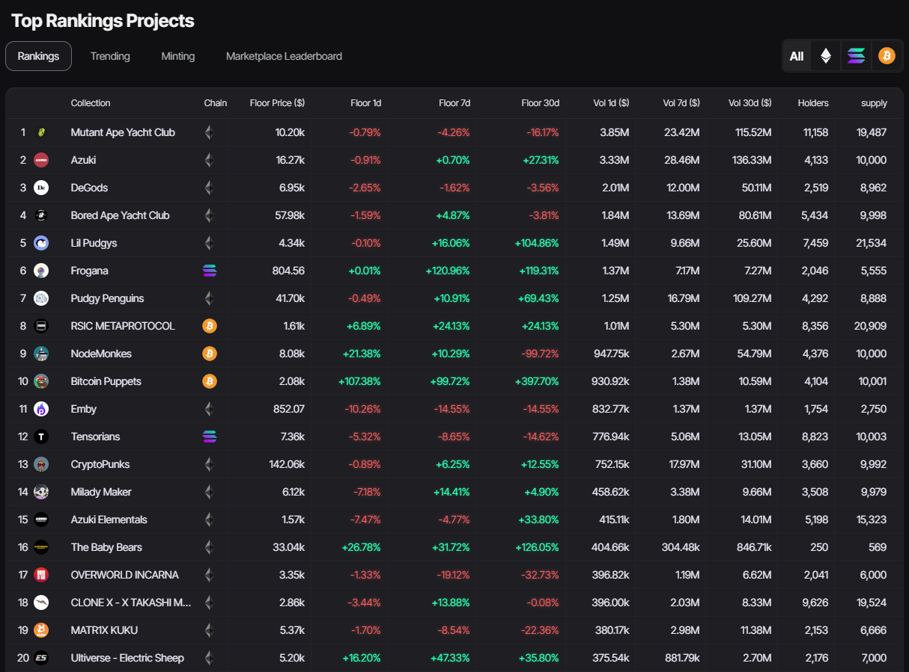

Rankings page, where we are dedicated to providing you with deeper on-chain insights about projects that may not be intuitively understood from traditional marketplaces. Our goal here is to uncover comprehensive analytics that go beyond surface-level data, offering you a more profound understanding of the projects within the NFT ecosystem.

Our rankings go beyond the surface metrics, empowering you with a comprehensive view of each project's performance, adoption, and potential.

Uncover the power of data-driven analysis, unlocking the secrets that may not be apparent at first glance in traditional marketplaces. Our "Rankings" page serves as your gateway to valuable insights, arming you with the knowledge needed to make well-informed decisions in the NFT market.

