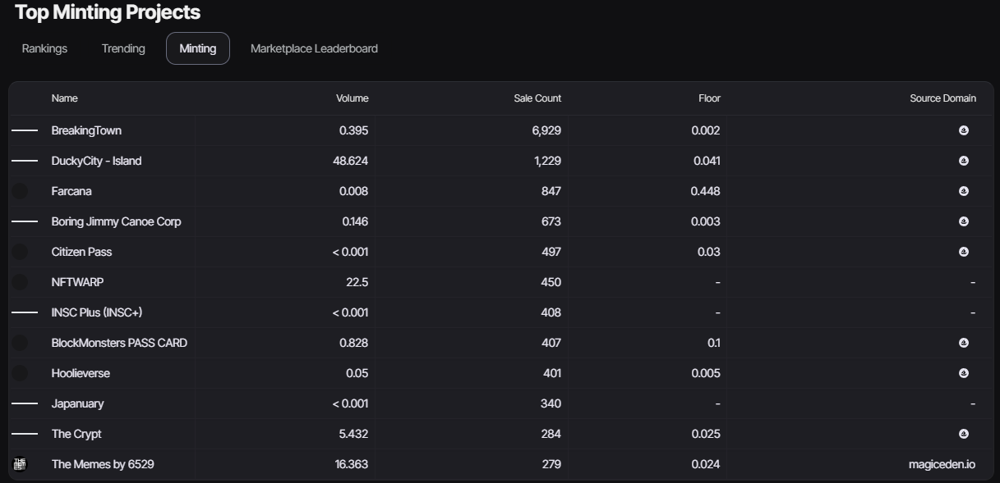

### Understanding Minting: Creation, Authenticity, and Market Dynamics of NFTs

Minting is the process of creating NFTs on a specific blockchain, guaranteeing authenticity and ownership. The minting volume represents the total number of NFTs created, while the sales count indicates successful transactions. The minimum sale price (floor) is the lowest value at which an NFT is available for purchase. The domain of origin refers to the blockchain where the NFTs were minted, affecting their liquidity and interoperability.

:::tip See the latest creations.
:::

