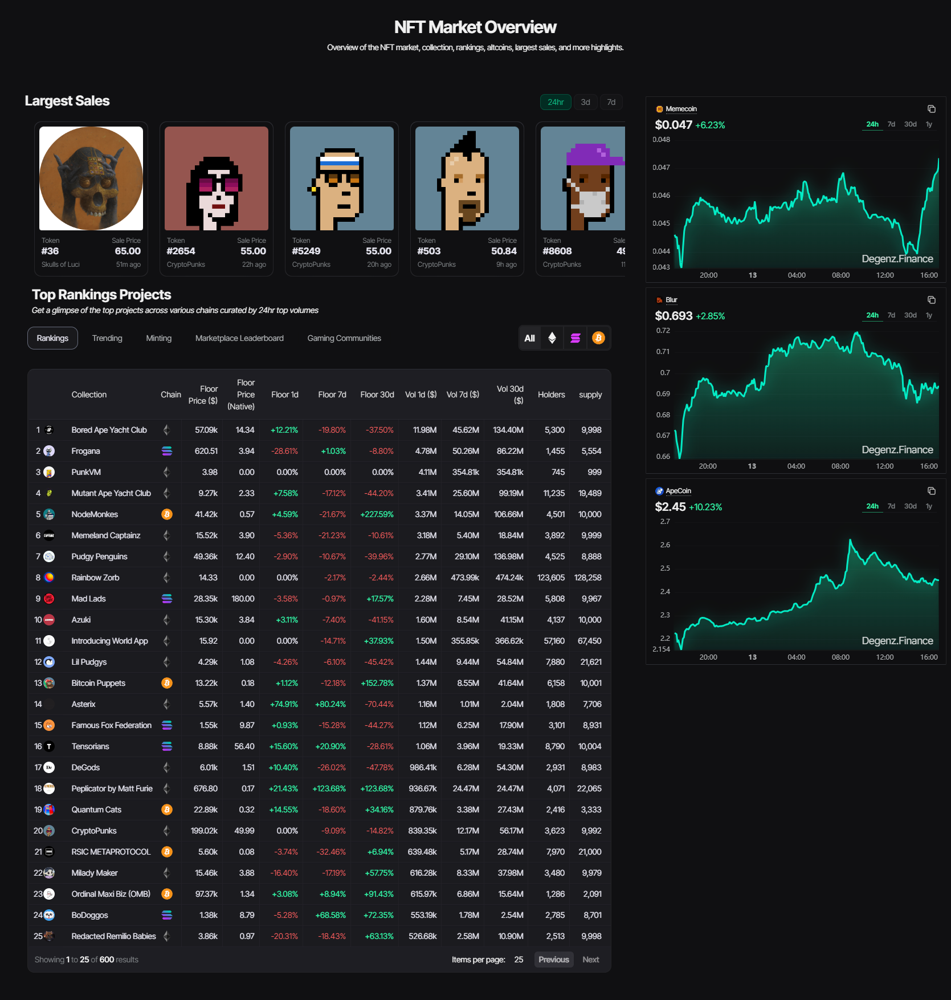

### Explore the world of NFTs

In the world of NFTs, each token acts as a digital certificate for a unique piece of art or item. Here you'll find graphs and numbers that show how much people are spending on NFTs, how many they are buying and selling, and whether prices are going up or down. Discover sought-after NFT collections like works by renowned artists. Learn about popular purchases like art and other digital items. Compare different NFT purchasing platforms including prices, fees and special offers. Dive into the details about NFTs themselves – what they are, who created them, and how much they are currently selling for.

This provides a simple way to stay informed about the growing universe of NFTs, with clear insights into trends, collections and available platforms.

:::info In the image we can see in more detail what we talked about above.
:::

