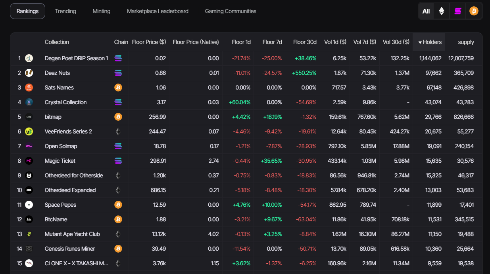

Our rankings table presents key metrics for various NFT projects. The table provides insights into the collection name, blockchain platform, minimum price in the native currency, minimum price in USD, as well as the minimum prices for specific periods.

There is also data on the trading volume where we can select the desired period, along with the number of unique holders and the total supply for each project.

:::tip Top Rankings provides a comprehensive view of the NFT market, allowing you to track all trends and compare project performances
:::

