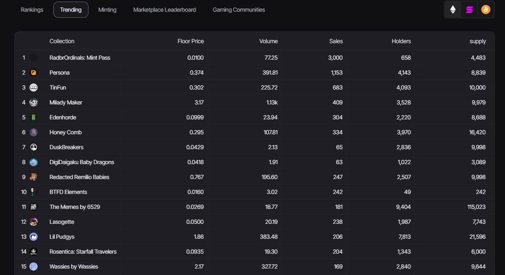

### Explore the Most Active NFT Projects: Key Metrics and Collection Details

In this table of the most active projects, presenting essential metrics such as trading volume, number of sales, number of holders, and information about collection, minimum price, and total supply for each project.

:::tip Stay updated with the trending collections by volume
::::

